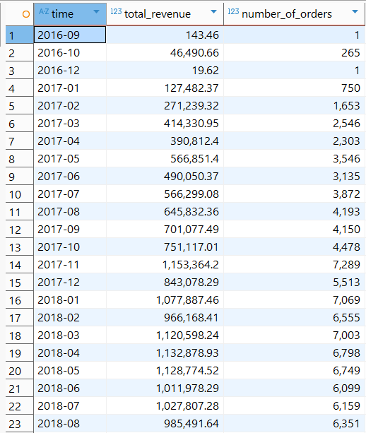
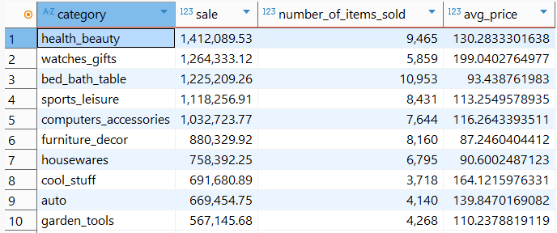
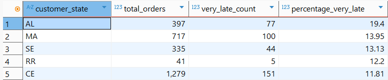
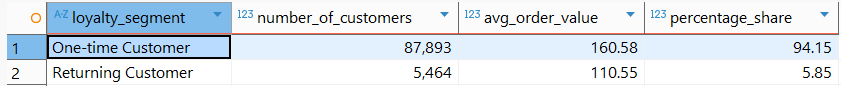
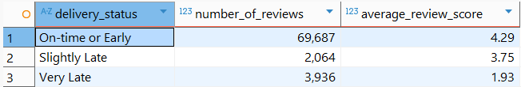

# 📊 Brazilian E-commerce Analysis (Olist Dataset)

### **Project Overview**
This project focuses on extracting actionable business insights from a large-scale e-commerce dataset. Using **SQL**, I analyzed over 100,000 orders to understand sales growth, logistics efficiency, customer loyalty, and the impact of delivery performance on brand reputation. This project was developed as a practical exercise to master SQL and business data analysis, where I utilized AI assistance to refine complex logic and optimize the analytical workflow.

---

## 📈 Task 1: Monthly Revenue
#### **Objective:**
To track the platform's financial health by identifying monthly revenue growth and order volume patterns.

#### **SQL Query:**
```sql
SELECT 
strftime('%Y-%m', order_purchase_timestamp) AS time, ROUND(SUM(items.price + items.freight_value), 2) AS total_revenue, 
COUNT(DISTINCT orders.order_id) AS number_of_orders 
FROM olist_orders_dataset AS orders
INNER JOIN olist_order_items_dataset AS items
ON orders.order_id = items.order_id
WHERE orders.order_status = 'delivered'
GROUP BY time 
ORDER BY time ASC;
```

#### **Analysis & Results:**
The query examines every delivered order and groups them into monthly intervals, showing both total revenue and the number of orders for each month.

#### **Visual Result:**


#### **Business Insights:**
The data shows a consistent upward trend in both revenue and the number of orders, with a significant peak in **November 2017** (probably due to Black Friday). Understanding these peaks helps the business plan inventory and server capacity for future high-traffic seasons.

---

## 📦 Task 2: Top Product Categories
#### **Objective:**
To identify which product category provides the most revenue and determine if they rely on high sales volume or premium pricing.

#### **SQL Query:**
```sql
SELECT trans.product_category_name_english AS category, ROUND(SUM(items.price + items.freight_value),2) AS sale,
COUNT (items.product_id) AS number_of_items_sold, AVG(items.price) AS avg_price
FROM olist_orders_dataset AS orders
INNER JOIN olist_order_items_dataset AS items
ON orders.order_id = items.order_id 
INNER JOIN olist_products_dataset AS products
ON items.product_id = products.product_id
INNER JOIN product_category_name_translation AS trans
ON products.product_category_name = trans.product_category_name 
WHERE orders.order_status = 'delivered'
GROUP BY trans.product_category_name_english
ORDER BY sale DESC 
LIMIT (10);
```

#### **Analysis & Results:**
The query links sold items to their specific categories and translates them into English using a translation table. It calculates total gross sales, the total volume of items sold, and the average price per item to provide a comprehensive view of category performance.

#### **Visual Result:**


#### **Business Insights:**
Health & Beauty and Watches are the primary revenue drivers for the platform. The analysis shows that different categories have different profit models: some (like Bed Bath Table) rely on high sales volume, while others (like Watches) generate high revenue through premium pricing. These insights allow the business to tailor marketing strategies and optimize stock levels based on category-specific performance.

---

## 🚚 Task 3: Regional Delivery Delays
#### **Objective:**
To pinpoint specific geographical regions experiencing critical shipping delays to optimize the logistics network.

#### **SQL Query:**
```sql
WITH delivery_performance AS (
SELECT customers.customer_state, orders.order_id,
CASE 
WHEN (julianday(orders.order_delivered_customer_date) - julianday(orders.order_estimated_delivery_date)) > 3 THEN 'Very Late'
WHEN (julianday(orders.order_delivered_customer_date) - julianday(orders.order_estimated_delivery_date)) > 0 THEN 'Slightly Late'
ELSE 'On-time or Early'
END AS delivery_status
FROM olist_orders_dataset AS orders
JOIN olist_customers_dataset AS customers ON orders.customer_id = customers.customer_id
WHERE orders.order_status = 'delivered'
AND orders.order_delivered_customer_date IS NOT NULL
)
SELECT customer_state,
COUNT(*) AS total_orders,
SUM(CASE WHEN delivery_status = 'Very Late' THEN 1 ELSE 0 END) AS very_late_count,
ROUND((SUM(CASE WHEN delivery_status = 'Very Late' THEN 1 ELSE 0 END) * 100.0) / COUNT(*), 2) AS percentage_very_late
FROM delivery_performance
GROUP BY customer_state
ORDER BY percentage_very_late DESC
LIMIT 5;
```
#### **Analysis & Results:**
The query compares the actual delivery date with estimated delivery date promised to the customer. Based on the ddifference between these days, delivered orders were categorized as On-time or Early, Slightly Late and Very Late (more than 3 days of delivery delay). This allowed for calculating the percentage of critical delays (marked as Very Late) of all orders per state, identifying regional logistical bottlenecks.

#### **Visual Result:**


#### **Business Insights:**
The analysis identifies specific states (primarily in the North-East region) that suffer from significantly higher critical delay rates compared to the rest of the country. The company should evaluate its carrier partnerships to  provide better delivery performance in these high-delay states.

---

## 👥 Task 4: Customer Retention
#### **Objective:**
To measure customer "stickiness" by identifying returning users and evaluating their spending habits compared to one-time buyers.

#### **SQL Query:**
```sql
WITH customer_order_counts AS (
SELECT customers.customer_unique_id,
COUNT(orders.order_id) AS order_count,
SUM(payments.payment_value) AS total_spent
FROM olist_orders_dataset AS orders
INNER JOIN olist_customers_dataset AS customers ON orders.customer_id = customers.customer_id
INNER JOIN olist_order_payments_dataset AS payments ON orders.order_id = payments.order_id
WHERE orders.order_status = 'delivered'
GROUP BY customers.customer_unique_id
),
customer_segmentation AS (
SELECT customer_unique_id, order_count, total_spent,
CASE 
WHEN order_count > 1 THEN 'Returning Customer'
ELSE 'One-time Customer'
END AS loyalty_segment
FROM customer_order_counts
)
SELECT 
loyalty_segment,
COUNT(customer_unique_id) AS number_of_customers,
ROUND(AVG(total_spent / order_count), 2) AS avg_order_value,
ROUND(COUNT(customer_unique_id) * 100.0 / (SELECT COUNT(*) FROM customer_segmentation), 2) AS percentage_share
FROM customer_segmentation
GROUP BY loyalty_segment;
```
#### **Analysis & Results:**
The query tracks unique individual customers throughout the platform's history and segments them into "Returning" and "One-time" categories, so it is able to compare the size of each group, their percentage share and their average transaction value.

#### **Visual Result:**


#### **Business Insights:**
The vast majority of the database consists of one-time buyers, which highlights a massive opportunity for growth through retention-focused marketing and loyalty programs. Understanding the spending patterns of returning customers allows the business to calculate a more accurate Customer Lifetime Value (LTV), which is crucial for determining how much can be spent on acquiring new users.

---

## ⭐ Task 5: Delivery vs Satisfaction
#### **Objective:**
To prove the direct correlation between shipping speed and customer ratings (Review Scores).

#### **SQL Query:**
```sql
WITH delivery_and_reviews AS (
SELECT orders.order_id, reviews.review_score,
CASE 
WHEN (julianday(orders.order_delivered_customer_date) - julianday(orders.order_estimated_delivery_date)) > 3 THEN 'Very Late'
WHEN (julianday(orders.order_delivered_customer_date) - julianday(orders.order_estimated_delivery_date)) > 0 THEN 'Slightly Late'
ELSE 'On-time or Early'
END AS delivery_status
FROM olist_orders_dataset AS orders
JOIN olist_order_reviews_dataset AS reviews ON orders.order_id = reviews.order_id
WHERE orders.order_status = 'delivered'
AND orders.order_delivered_customer_date IS NOT NULL
)
SELECT 
delivery_status,
COUNT(*) AS number_of_reviews,
ROUND(AVG(review_score), 2) AS average_review_score
FROM delivery_and_reviews
GROUP BY delivery_status
ORDER BY average_review_score DESC;
```

#### **Analysis & Results:**
This analysis connects logistics data with customer sentiment. By calculating the difference between actual and estimated delivery dates, orders were categorized into three delivery delay segments (same as Task3). Then the average review score (1-5) was calculated for each segment. This reveals exactly how much delivery performance impacts customer satisfaction.

#### **Visual Result:**


#### **Business Insights:**
The data clearly shows a sharp decline in average ratings for "Very Late" deliveries compared to those that arrive on time. Logistics is a critical driver of brand reputation. Improving shipping reliability is the most direct way to increase the overall satisfaction score of the platform. This correlation helps the business justify higher investments in logistics optimization by showing its direct impact on customer feedback.

---

## 🏁 Final Business Conclusion
Based on the comprehensive SQL analysis of the Olist dataset, the company’s condition can be summarized as follows:

* **Growth Potential:** The business is in a strong expansion phase, with consistent monthly revenue growth and massive scalability during peak seasons like Black Friday.
* **Operational Issue:** Logistics is the biggest threat to the company’s reputation. Regional delivery bottlenecks (especially in the North-East) directly correlate with poor customer ratings.
* **Customer Loyalty Gap:** The platform currently relies heavily on new customer acquisition. The high percentage of one-time buyers suggests that Olist hasn't yet mastered customer retention, which could lead to high marketing costs in the long run.
* **Product Catalog Structure:** The platform's revenue is based on two different profit models of their products: cheaper product with high sales volume and more expensive products (premium pricing) with lower volume sales. To maximize profitability, the company may need to decide on a dominant strategy: either **Premium Pricing** or **High-Volume efficiency**. Focusing on premium goods allows for higher service standards, while mass volume requires a simplified, ultra-efficient shipping model.
